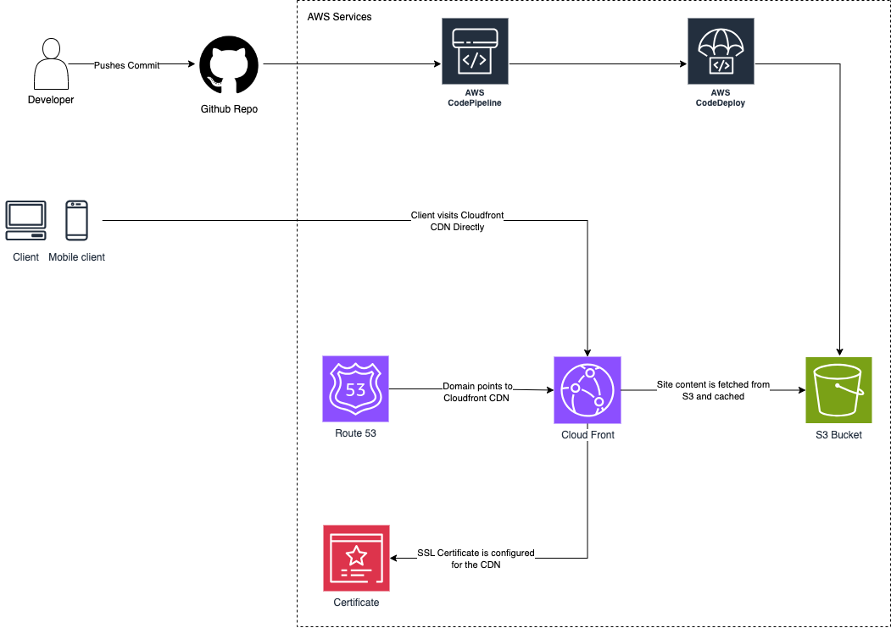

# Juanton Dev Portfolio 2024

This is a [Next.js](https://nextjs.org) project bootstrapped with [`create-next-app`](https://nextjs.org/docs/app/api-reference/cli/create-next-app).

## Running the Development Server Locally

First, run the development server:

```bash
npm run dev
# or
yarn dev
# or
pnpm dev
# or
bun dev
```

Open [http://localhost:3000](http://localhost:3000) with your browser to see the result.

You can start editing the page by modifying `app/page.tsx`. The page auto-updates as you edit the file.

## App Architecture

This application will have a simple architecture to keep costs down and showcase my AWS Cloud Certification. I have chosen to use a static export of the Next.js app so I can store in an Amazon S3 bucket. I will also use the Cloud Front CDN Service to serve this file so it will load very quickly. This is a serverless architecture and will reduce the costs of running my site.

I will also use Route53 and Certificate Manager to point to the CDN and add an SSL certificate to the site.

Here is a diagram of the proposed arcitecture:



The last step will be to setup CodePipline and CodeDeploy so I can simply merge PRs to the main branch for a build to kickoff and auto deploy the application. _This is not working yet but is planned for a future commit._

The app deployment is done using the AWS CLI CDK and all of the setup can be seen in the file `/devops/lib/devops-stack.ts`.

## Setup your Domain to point to AWS Route 53

This app uses Route53 to point a domain at our CloudFront CDN Service that will serve our application from the s3 bucket. If you have a registered domain through a 3rd party domain provider, you will need to update the nameservers in your domain provider admin panel to point to the Route53 nameservers.

Follow these instructions to get the nameservers:
https://docs.aws.amazon.com/Route53/latest/DeveloperGuide/GetInfoAboutHostedZone.html

Once you have updated your nameservers, you can update the domain that will be used for the deployment by chaning it in the file `/devops/lib/devops-stack.ts`.

## Deploy the App

In order to deploy the app, you'll need to do 2 things.

1. Build the application
2. Deploy the application using the AWS CLI CDK

To do that, we can build the application by running

```bash
npm build
```

while in the root directory. If the build completes with no errors, we will have a static export of the site in our `/dist` folder.

Next we will need to change directories to the `/devops` folder and then run the deploy command.

**Important Note**: You will need to setup AWS CLI credentials first or the deploy script will fail. Check out the next section below on how to set this up before proceeding.

Once you have completed your build and are ready to deploy simply run the deploy command in the `/devops` folder.

```bash
cd devops
cdk deploy
```

This will kick off the deployment and if everything succeeds, your app will be running the supplied route.

## Setting up AWS CLI Credentials

You will need to setup AWS CLI credentials first or the deploy script will fail. To do so, make sure you have an IAM user created in AWS. Create new security credentials for that user and take note of them as they can only be shown once. You'll need your `aws_access_key_id` and `aws_secret_access_key`. DO NOT SHARE your `aws_secret_access_key` with anyone and make sure it is NEVER committed into your repo.

Once you have created the security credentials simply run the command `cdk configure` which will bring up a prompt where you can paste in the two values from above. Once you have done this, you should have a user profile and credentials setup on your local machine. You can verify this by running the two commands:

```bash
cat ~/.aws/credentials
cat ~/.aws/config
```

These will output the credentials you set above.

To learn more about setting up credentials check out these two links:

https://docs.aws.amazon.com/cdk/v2/guide/getting_started.html
https://docs.aws.amazon.com/cdk/v2/guide/configure-access.html
